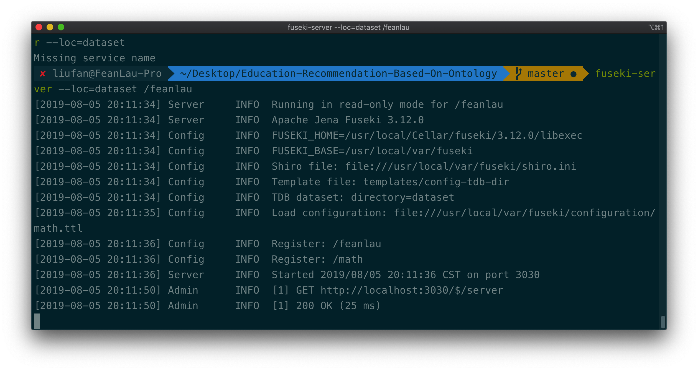
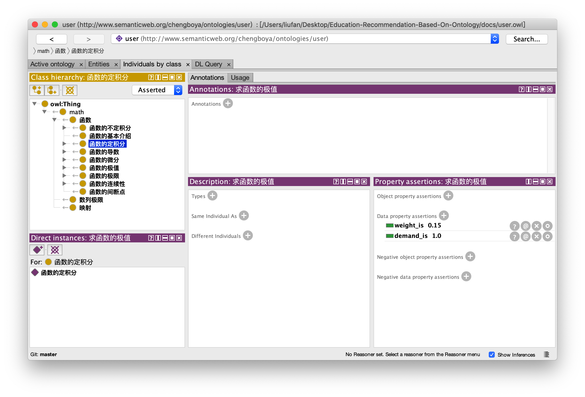
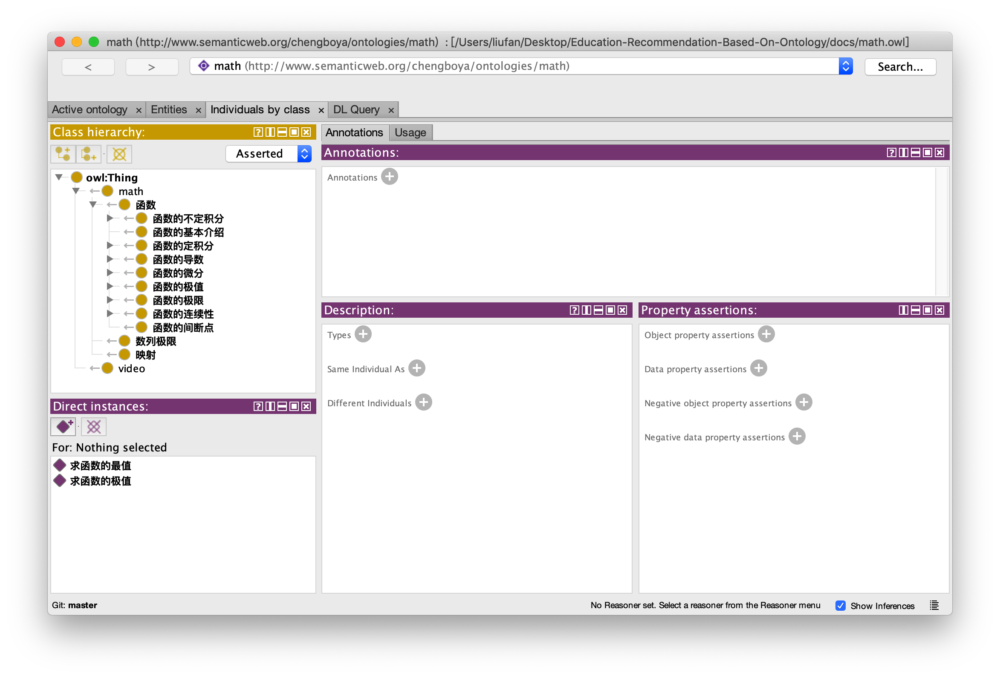

# 运行说明

## 下载依赖

```
# 进入 Project 目录
cd project
# 下载项目运行所需要的依赖
pip3 install -r requirements.txt
```

## 登录

后台登陆 http://127.0.0.1:8000/admin/ 


Django administration  后台是可以修改用户名和密码的

```
python3 manage.py dumpdata > datadump.json
```

导出数据到json


## 运行本体的展示

从这里看出

```
        self.sparql = SPARQLWrapper("http://localhost:3030/%s/sparql" % dataset,
```

运行需要 Fuseki 的服务器的，dataset就是数据

### 事先将三元组数据导入tdb

```
# 加载 dataset 目录下的数据
fuseki-server --loc=dataset /dataset
```

拿到了这里的math.ttl 然后导入成功，从后端的Fuseki拿到了数据成功了



这个项目的启动需要两种服务器的，一个是3030的Fuseki，一个是http://127.0.0.1:8000的Python Web端


## Django 项目启动成功

```
python3 manage.py runserver
```

在浏览器上打开```http://127.0.0.1:8000```，可以看到界面的。

至此，通过两个步骤项目运行成功了。

##  Protege 打开 user.owl 文件



##  Protege 打开 math.owl 文件



## math.ttl

- math.owl 本体结构文件

- user.owl 用户画像文件

- math.ttl 三元组数据文件
